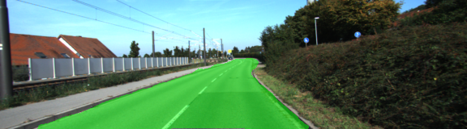
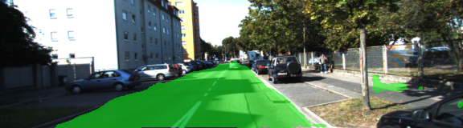
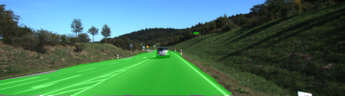
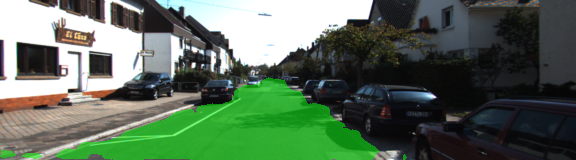

## Semantic Segmentation
### Introduction
Labeling the pixels of a road in images using a Fully Convolutional Network (FCN)  
  
Based on [Long et al.: Fully Convolutional Networks for Semantic Segmentation](https://people.eecs.berkeley.edu/~jonlong/long_shelhamer_fcn.pdf)  

### Scope of Project
- Started from saved VGG16 model that already had dense layers converted to convolution layers
- Implemented the code in the `main.py` module indicated by the "TODO" comments
-- Resample layers down to only two classification categories (road / no road)
-- Upsampling of layers back to full input image size
-- Add skipped connections
- Trained on Kitti Road dataset for 100 epochs

### Results
Sample result images for road classification:
  
  
  
  
  


### TODO
- Perform image augmentation
- Run an extended training session

### Setup
##### Frameworks and Packages
Make sure you have the following is installed:
 - [Python 3](https://www.python.org/)
 - [TensorFlow](https://www.tensorflow.org/)
 - [NumPy](http://www.numpy.org/)
 - [SciPy](https://www.scipy.org/)
##### Dataset
Download the [Kitti Road dataset](http://www.cvlibs.net/datasets/kitti/eval_road.php) from [here](http://www.cvlibs.net/download.php?file=data_road.zip).  Extract the dataset in the `data` folder.  This will create the folder `data_road` with all the training a test images.

##### Run
Run the following command to run the project:
```
python main.py
```
